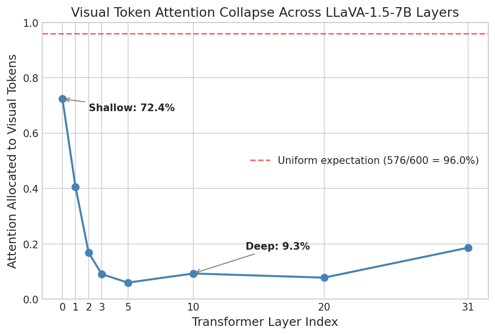
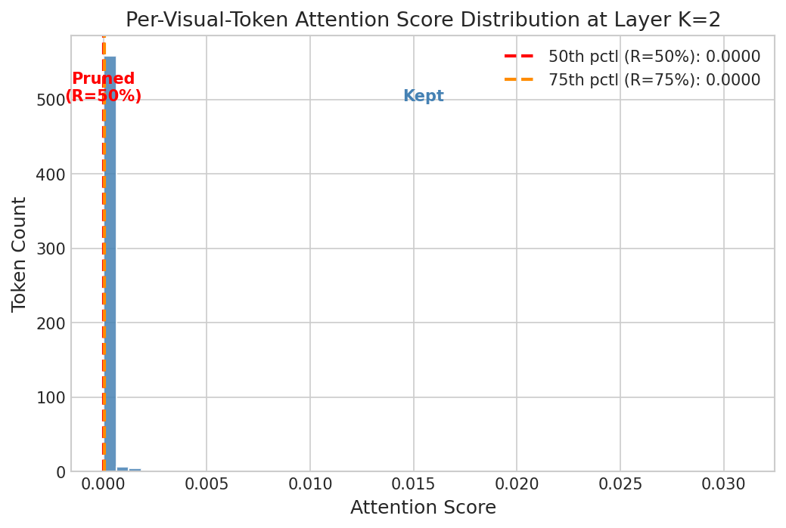
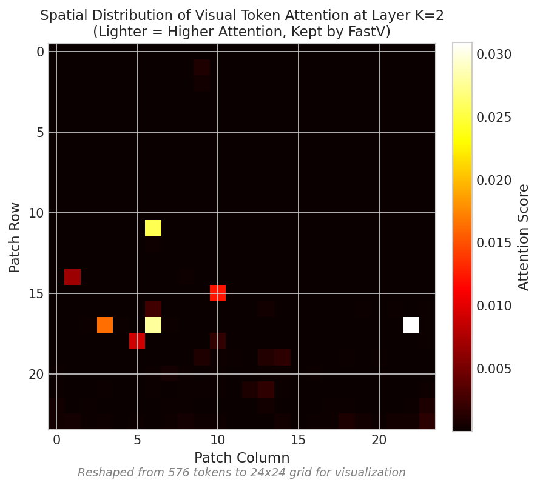
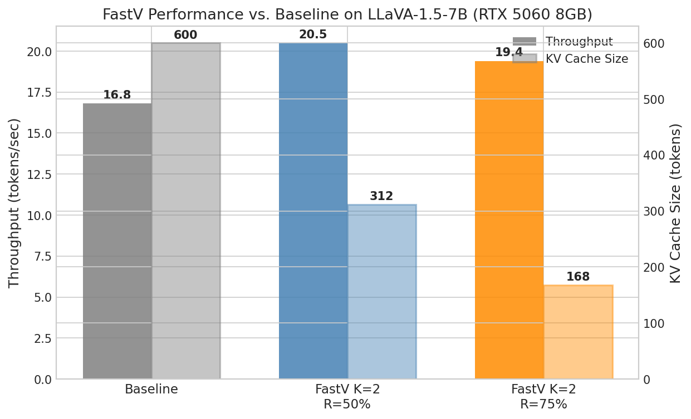
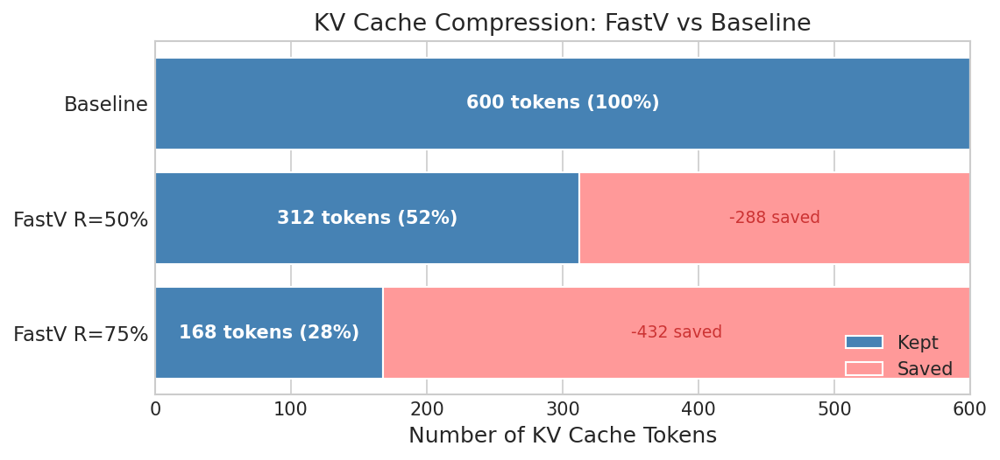

# FastV Reproduction: Step-by-Step Analysis

A walkthrough of the reproduction of **FastV** on `llava-hf/llava-1.5-7b-hf` (4-bit INT4, RTX 5060 8 GB).

---

## Section 1 — The Problem: Why Visual Tokens Are Inefficient

Vision-language models like LLaVA process images as sequences of patch embeddings (576 tokens for a 336×336 image with 14×14 patches). These visual tokens are concatenated with text tokens and passed through a standard transformer decoder. The naive assumption is that all 576 visual tokens remain equally useful throughout all 32 transformer layers.

**The attention collapse phenomenon contradicts this.** When you measure the fraction of total attention that each layer directs toward visual tokens, a striking pattern emerges:

- **Shallow layers (0–2):** Visual tokens receive the majority of attention — 72% at layer 0. The model is still "looking at" the image.
- **Deep layers (3–20):** Attention to visual tokens collapses to 6–9%, far below what uniform distribution would predict (576/600 ≈ 96%).
- **Implication:** Deep layers spend 90%+ of their attention on fewer than 5% of tokens (text), while maintaining a full KV cache for all 576 visual positions.

This is pure compute waste: the KV cache entries for low-attention visual tokens occupy memory bandwidth every decode step but contribute almost nothing to the output.



The red dashed line shows the uniform expectation (576 visual / 600 total ≈ 96%). The measured values fall dramatically below this after just two layers, confirming the paper's central claim.

---

## Section 2 — The FastV Algorithm

FastV exploits the attention collapse with a two-parameter solution:

- **K** — the layer at which to profile attention scores and prune tokens. The paper sets K=2, where collapse has begun but the scores still discriminate well between salient and non-salient patches.
- **R** — the pruning ratio: the fraction of visual tokens to discard. R=50% removes the bottom 288 tokens; R=75% removes 432.

### Pruning Math

At layer K, FastV computes a scalar attention score for each visual token by averaging the attention that all text tokens direct toward it (FastV Eq. 3). Tokens are then ranked and the bottom R% are dropped:

```
keep_count = floor(576 × (1 - R))

R = 0.50  →  keep_count = floor(576 × 0.50) = 288  →  KV size = 24 + 288 = 312
R = 0.75  →  keep_count = floor(576 × 0.25) = 144  →  KV size = 24 + 144 = 168
```

(The 24 non-visual tokens — system prompt + question — are always kept.)

The resulting per-token score distribution at layer K=2 is highly skewed. Most tokens cluster near zero; a small number of spatially coherent patches receive disproportionately high attention:



The 50th-percentile threshold (R=50%) and 75th-percentile threshold (R=75%) are marked. Note how the distribution is nearly zero for the majority of tokens — this confirms that pruning the bottom half discards tokens that were already contributing negligibly.

The spatial structure of which tokens are retained is visible in the attention heatmap:



Lighter regions (higher attention score) correspond to semantically salient patches. FastV preserves these; the dark background patches are discarded.

---

## Section 3 — Results

### Benchmark Numbers

Three-way comparison on the 336×336 four-quadrant test image (red/blue/green/yellow with a white circle):

| Method          | Throughput (tok/s) | VRAM     | KV Tokens | Speedup |
|-----------------|--------------------|----------|-----------|---------|
| Baseline        | 16.8               | 3.84 GB  | 600       | 1.00×   |
| FastV K=2 R=50% | 20.5               | 4.06 GB  | 312       | +22%    |
| FastV K=2 R=75% | 19.4               | 3.97 GB  | 168       | +16%    |





### Observations

- **+22% throughput at R=50%:** each decode step attends over 312 instead of 600 KV positions — a 48% shorter sequence.
- **VRAM does not decrease:** the two-pass approach (see Section 4) stores the full prefill cache before pruning, so peak allocation equals the unpruned baseline.
- **R=75% is slightly slower than R=50%:** at very aggressive pruning the saved attention compute is offset by overhead from the manual decode loop.

---

## Section 4 — Key Engineering Challenges

### Two-Pass vs. Single-Pass Approach

The FastV paper's reference implementation uses **single-pass inline pruning**: at layer K, `hidden_states` is truncated to remove the low-scoring visual token positions. Layers K+1 through 31 then process a shorter sequence — both the KV writes and the attention computation are reduced for the remaining forward pass.

This repository uses a **two-pass approach** instead:

| | Single-Pass (paper) | Two-Pass (this repo) |
|---|---|---|
| **Prefill FLOPs** | Reduced (layers K+1–31 see fewer tokens) | Identical to baseline |
| **KV cache after prefill** | Pruned during prefill | Full → pruned after |
| **Decode attention cost** | Reduced | Reduced |
| **`model.generate()` compatible** | Yes (with custom forward hooks) | No — bypassed entirely |

**Why two-pass?** LLaVA's `prepare_inputs_for_generation()` validates the shape of `past_key_values` at every decode step and rejects any cache whose sequence dimension has been modified. Passing a pruned cache directly triggers a shape mismatch error. The workaround is to bypass `model.generate()` entirely and drive the LLM backbone (`model.language_model.model`) in a manual autoregressive loop, forwarding one token embedding at a time with the pruned cache as `past_key_values`.

This is a valid approximation for measuring **decode throughput** — which is the primary bottleneck in long-generation tasks — but does not reproduce the paper's full prefill FLOPs savings.

### bitsandbytes Compilation for Blackwell sm_120

The RTX 5060 uses NVIDIA's Blackwell architecture (compute capability sm_120), which was not yet supported by any PyPI bitsandbytes wheel at time of writing. The solution is to compile from source:

```bash
git clone https://github.com/TimDettmers/bitsandbytes.git
cd bitsandbytes
cmake -DCOMPUTE_BACKEND=cuda -DSM=120 -B build
cmake --build build --config Release
pip install -e .
```

**Critical gotcha:** do not pass `-DCUDA_VERSION` as a string — it triggers a CMake numeric-comparison parsing bug. CMake reads the CUDA version automatically from the toolkit when the flag is omitted.

Without this step, 4-bit quantization (`BitsAndBytesConfig`) fails with a CUDA kernel not found error on Blackwell GPUs.
